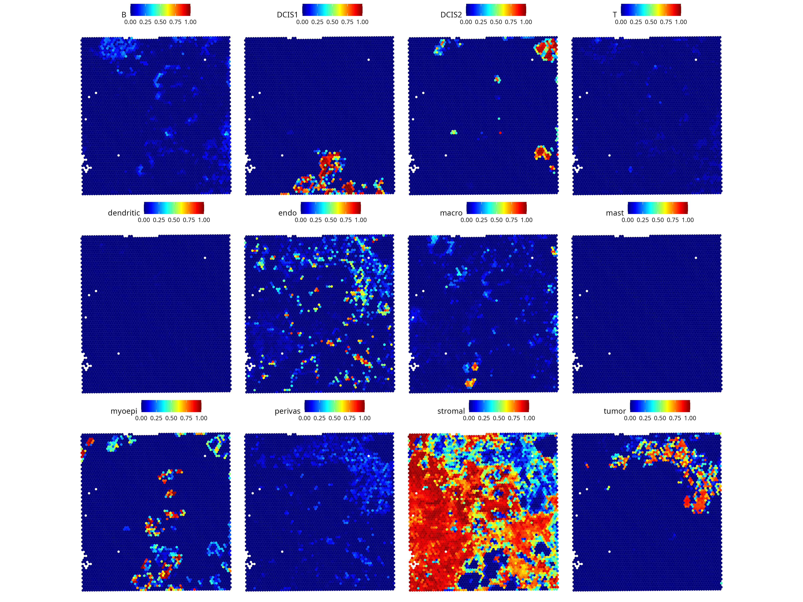
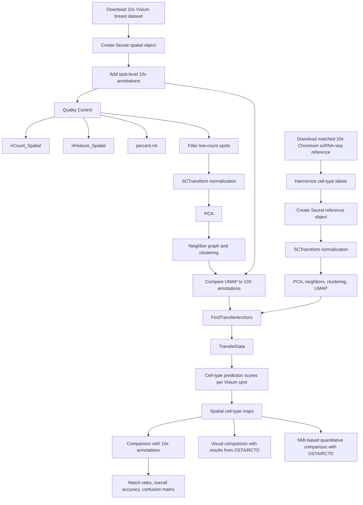
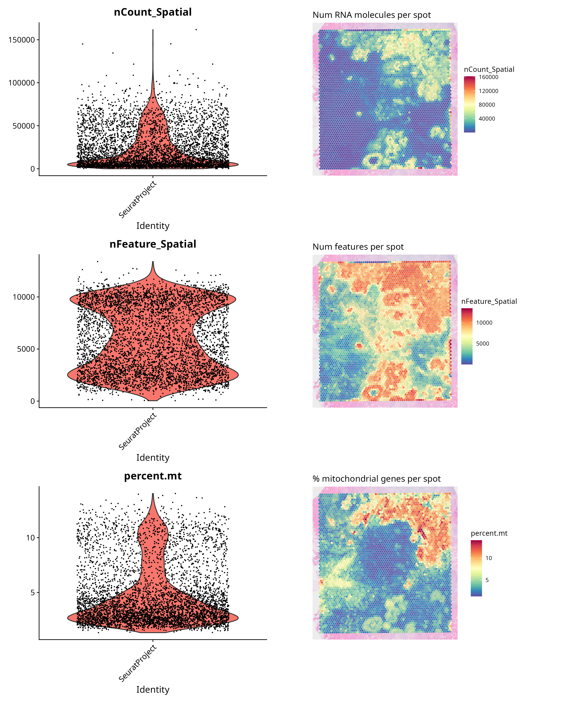
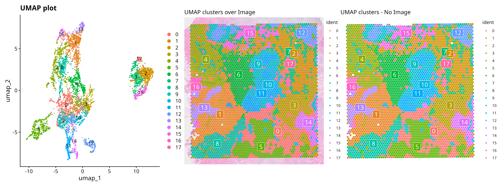
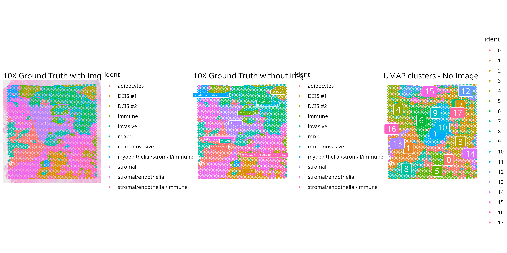
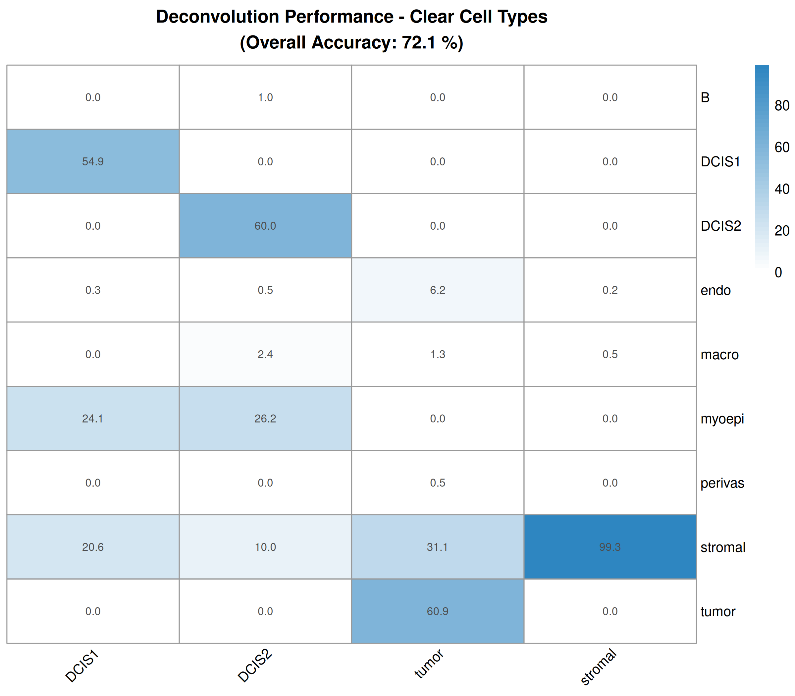

Author: Georg Sommer

# Spatial Deconvolution of the Human Breast Tumor Microenvironment Using Seurat Label Transfer

## Research questions

- Do the spatial maps from this TME dataset visually differ when produced with Seurat’s integration-based deconvolution instead of RCTD’s probabilistic deconvolution?
- Is there an increase in NMI achieved by optimally aligning the Seurat map to the RCTD map using affine transformations?
- How close are Seurat's cell type predictions to the annotation provided by 10X? (where the predictions are comparable).

## One-sentence summary

This project integrates 10x Visium spatial transcriptomics with a matched 10x Chromium single-cell RNA-sequencing reference to estimate cell-type composition across breast tissue, validate predictions against available annotations, and compare the Seurat-based result with an alternative OSTA/RCTD workflow.

---

## Purpose of this work

The purpose of this work is to demonstrate an end-to-end, reference-based analysis of a human breast spatial transcriptomics dataset in Seurat, and validate this analysis using results of a similar analysis by OSTA-team with Bioconductor. 

The analysis is designed to produce interpretable spatial cell-type maps, evaluate how well transferred labels agree with available tissue annotations, and document the methodological decisions that influence the final result.

## Aims

This project aims to:

1)  Spatial transcriptomics workflow interoperation by translating the OSTA chapter 12 workflow to the Seurat framework.
2)  Visually compare differences in spatial maps produced by our deconvolution using `Seurat::FindTransferAnchors()` and OSTA's deconvolution using RCTD.
3)  Use NMI to quantify the change in spatial alignment between spatial maps from `Seurat::FindTransferAnchors()` and RCTD after affine registration with the NiftyReg algorithm.
4)  Calculate match rates between Seurat predictions and ground truth supplied by 10X.

(Bonus) Visually compare Seurat's UMAP clustering vs the ground truth cell type IDs provided by 10X genomics.

---

## Main figure

  

**Main figure:** a multi-panel `SpatialFeaturePlot` showing oncologically informative predicted cell types.

---

## Workflow overview

---

---

## Key results

### 1. Quality Control metrics appear to have shared definite borders

  

**Figure 1:** Quality Control violin and spatial overlay plots showing total counts, detected features, and mitochondrial percentage.

### 2. UMAP reveals transcriptionally distinct spot groups

  

**Figure 2:** UMAP and spatial clustering plots.

  

**Figure 3:** 10X annotations aligned against UMAP spatial plot.  

### 3. Spatial cell-type predictions recover tissue microenvironment structure

  

**Figure 4:** Spatial prediction-score maps for different cell types

 

#### Interpretation of the cell type maps Fig. 4

- B and T cells are specific immune response cells.

- DCIS1 and DCIS2 are distinct breast cancer specific subpopulations. DCIS (Ductal Carcinoma In Situ) are pre cancerous/pre invasive cells that are localized in the milk ducts.

- endo: Endothelial cells mark blood vessels. These are found everywhere but especially around the tumor because it builds its own blood supply/vessels (angiogenesis).

- macro: Macrophages are general immune response cells. As frontline immune response, these "eat"" other cells that they don't recognize as self/own tissue. Tumor associated macrophages is a phnomenon seen in many cancers. Macrophages overlap here w. DCIS more than w. the tumor. 

- myoepi: Myoepithelial cells mark milk ducts and overlap w. DCIS 1 and 2 as expected.

- perivas: Perivascular (near blood vessels) overlap w. tumor. That is another measure for tumor building its own blood supply.

- stromal cells provide support to tumor: 
  - help it survive against (immuno/chemo)therapies
  - their numbers skyrocket when there is cancer (desmoplastic response)

### 4. Confusion Matrix summarizes agreement with 10X annotations

  

**Figure 5:** Column-normalized confusion matrix for Seurat vs 10X cell-type mappings

### 5. Image registration does not improve aligment [NMI-score] with OSTA/RCTD, but NMI-score is already very high.

---

## Skills demonstrated

- Spatial transcriptomics analysis
- scRNA-seq reference integration
- Reference-based Label Transfer
- Cell-type Deconvolution
- Confusion Matrix analysis
- comparing computational methods

---

## Limitations:

- This version only calculates a confusion matrix on the Seurat results.
- The sample is one spatial transcriptomics slide/slice.
- No analysis is made into why one prediction algorithm captures certain oncological info better than the other.
- Did not find markers for clusters.
- Match rates are only calculated for a subset of cell types (DCIS #1, DCIS #2, invasive, stromal) in the ground truth annotation, which matched the cell types in the deconvolution reference.
- I do not have the methodology for "Ground Truth" cell type identification.

---

## Reproducibility

A text file containing the `sessionInfo()` has been included in this repository.

---
## References:

Citations are provided in references.txt